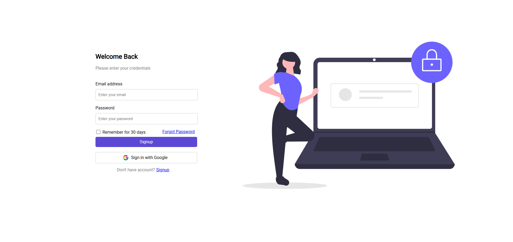

# 🔐 Responsive Login Page – HTML & CSS

Welcome to a sleek, modern, and responsive **Login Page** built using only **HTML** and **CSS**.  
Perfect for beginner portfolios, frontend practice, or integration into basic authentication workflows.

---

## 🌐 Live Demo

👉 [View Live on GitHub Pages](https://ajgautam01.github.io/login-design/)

---

## 📸 Preview

  
> *Ensure the image is named `preview.png` and placed inside the `assets/img/` folder.*

---

## 💡 Features

- ✅ Clean and minimalist UI
- ✅ Email & Password input fields
- ✅ "Remember Me" checkbox
- ✅ Forgot Password & Sign-Up links
- ✅ Google-style sign-in button with logo
- ✅ Eye-catching SVG illustration
- ✅ Fully responsive with Flexbox
- ✅ Google Fonts integration (`Roboto`)

---

## 📁 Folder Structure

```
📦 login-page
├── login.html
├── style.css
└── assets/
    └── img/
        ├── google.png
        ├── undraw_secure-login_m11a.svg
        └── preview.png
---

## 🚀 Live Demo

🌐 [View it Live on GitHub Pages](url)  
> Replace `your-repo-name` with the actual name of your GitHub repository.

---

## 🚀 Getting Started

1. **Clone** or **download** this repository  
2. Navigate to the project folder  
3. Open `login.html` in your browser  
4. That's it! 🎉

---

## 👨‍💻 Author

**AJ Gautam**  
🔗 [GitHub – @ajgautam01](https://github.com/ajgautam01)

---

## 📄 License

This project is available for **educational** and **personal** use.  
Attribution is appreciated but not required.

---

## 🙌 Contributions

Contributions are always welcome!  
Feel free to fork this repo, enhance the design, add new features, and open a pull request.

---
